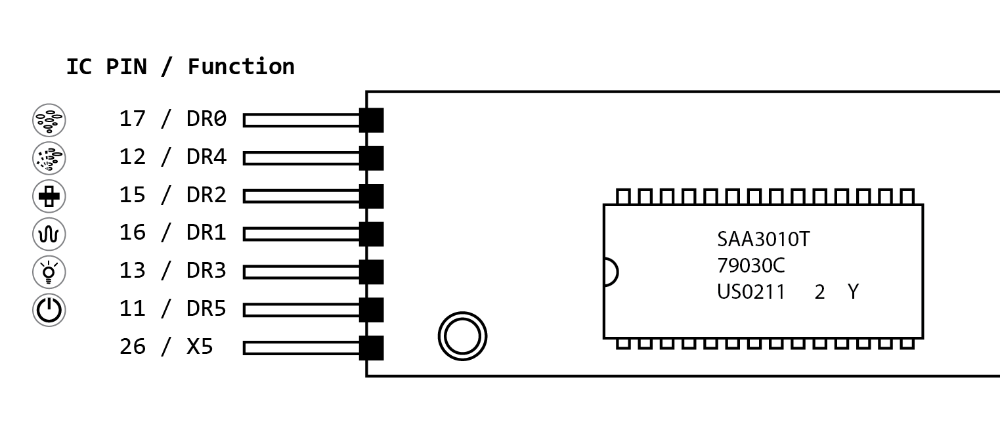

# Teardown and protocol identification

There was no easy way to open the remote enclosure (because it's water proof), 
so I ended up cracking it open with pliers to get to in. Inside there's 
pretty much what one would expect, a tube to act as the battery compartment, a
small PCB in the middle doing the logic and an IR led to send the commands.


## RC5 transmitter IC

The main attraction on the PCB is the Philips/NXP IC, which is an RC5 Infrared 
remote control transmitter that does pretty much everything on the board. 

These markings are printet on the chip, next to the Philips logo:

> **SAA3010T**  
> **79030C**  
> **US0211 2 Y**  

The data sheet can be found [here](SAA3010T-datasheet.pdf)

The chip handles the scanning of the remote buttons, and converting those into
valid [RC5 protocol](https://en.wikipedia.org/wiki/RC-5) commands and sending 
them out into the world via the IR led.

The [datasheet](SAA3010T-datasheet.pdf) explains how the key scan combinations
are converted into the RC5 address and command bits, so there's no code that
runs on the IC for this specific remote; all the information for the commands
is in the connections on the PCB (which is good, because I cannot capture the 
RC commands from a non-working remote).

## RC5 protocol parts

A command in the RC5 protocol is composed of 

* One start bit (fixed value of 1)
* One field bit (fixed value of 1)
* One control bit (toggled between commands)
* Five address bits (to set the system type, e.g. TV, VCR, etc)
* Six command bits (the actual command)

more information [here](https://en.wikipedia.org/wiki/RC-5)

We need to figure out the address and command bits to make a working
remote.

## Address bits

Finding the correct address bits was as simple as finding which Z- and 
DR lines from the IC were connected on the PCB. They turned out to be
Z3 (pin 6) and DR7 (pin 9). From the System matrix in the datasheet on
page 10, this dermines the system number 31 (a reserved system number), 
which has these system bits: ```11111```. 

## Key scanning and command construction (command bits)

With a multimeter I checked which buttons correspond to what pins on the 
RC5 IC:



As you can see it uses one X-line and 6 DR-lines to scan all the button
presses. The datasheet contains a nice table on page 9 to lookup the command
bits for those X/DR combinations.


