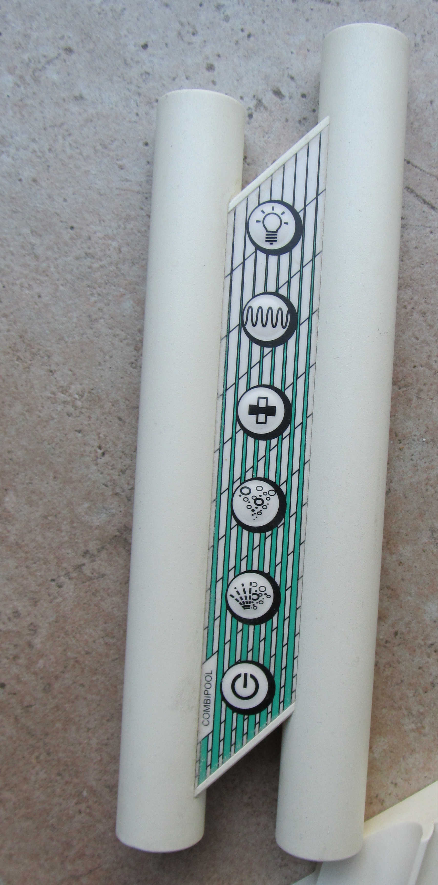

# Whisper Pool remote replacement

> TLDR: Whirlpool remote didn't work. I replaced it with an Arduino
> based remote that sent out the same [RC5](https://en.wikipedia.org/wiki/RC-5) remote 
> commands using this [Arduino IR-Remote library](https://github.com/z3t0/Arduino-IRremote).
>
> You can find the code [here](firmware) and the schematics and
> pcb design [here](hardware)
>
> I think this same solution should work for following whirlpools from Villeroy & Boch:
> 
> * Whisper Airpool
> * Clairpool
> * Whisper Whirlpool
> * Whisper Combipool

## The problem with the remote

Our home has a Villeroy and Boch whirlpool installed and after about half a 
year after we moved in and about three uses, the remote stopped functioning.

Opening the battery compartment made the cause cleary very quickly. The batteries
started leaking and (probably) deposited their acidic schmoo all over the pcb, 
corriding it and the components. As the remote enclosure is water proof and seems
to be glued together, there was no easy way to clean it. After trying to rinse it
out with some household chemicals through the battery compartment, it still didn't 
work.



There are replacement remotes availble, but they are about 150 euros. I like a 
working whirlpool, but not that much. So I decided to tear it down and see if there
was a likely fix.

## Teardown an protocol identification

There was no easy way to open the remote enclosure (because it's water proof), 
so I ended up cracking it open with pliers to get to in. Inside there's 
pretty much what one would expect, a tube to act as the battery compartment, a
small PCB in the middle doing the logic and an IR led to send the commands.


### RC5 transmitter IC

The main attraction on the PCB is the Philips/NXP IC, which is an RC5 Infrared 
remote control transmitter that does pretty much everything on the board. 

These markings are printet on the chip, next to the Philips logo:

> **SAA3010T**  
> **79030C**  
> **US0211 2 Y**  

The data sheet can be found [here](SAA3010T-datasheet.pdf)

The chip handles the scanning of the remote buttons, and converting those into
valid [RC5 protocol](https://en.wikipedia.org/wiki/RC-5) commands and sending 
them out into the world via the IR led.

The [datasheet](SAA3010T-datasheet.pdf) explains how the key scan combinations
are converted into the RC5 address and command bits, so there's no code that
runs on the IC for this specific remote; all the information for the commands
is in the connections on the PCB (which is good, because I cannot capture the 
RC commands from a non-working remote).

### RC5 protocol parts

A command in the RC5 protocol is composed of 

* One start bit (fixed value of 1)
* One field bit (fixed value of 1)
* One control bit (toggled between commands)
* Five address bits (to set the system type, e.g. TV, VCR, etc)
* Six command bits (the actual command)

more information [here](https://en.wikipedia.org/wiki/RC-5)

We need to figure out the address and command bits to make a working
remote.

### Address bits

Finding the correct address bits was as simple as finding which Z- and 
DR lines from the IC were connected on the PCB. They turned out to be
Z3 (pin 6) and DR7 (pin 9). From the System matrix in the datasheet on
page 10, this dermines the system number 31 (a reserved system number), 
which has these system bits: ```11111```. 

### Command bits (via key scanning)

With a multimeter I checked how the buttons wires corresponded to the pins on the 
RC5 IC. It turns out that one wire was connected to the X5 pin and all the other
pins to 6 DR-lines.


When a buttons is pressed, it connects on of the DR pins to the X5 pin. The datasheet 
contains a nice table on page 9 to lookup the command bits for those X/DR combinations.


### Complete commands

| Button                                                 | Code | Start bit | Field bit | Control bit | Address bits | Command bits | => | Complete command | 
|--------------------------------------------------------|------|-----------|-----------|-------------|--------------|--------------|:--:|-----------------:|
|  | 40   | 1         | 1         | 1/0         | 11111        | 101000       | => | 11111111101000   |
|  | 41   | 1         | 1         | 1/0         | 11111        | 101001       | => | 11111111101001   |
|  | 42   | 1         | 1         | 1/0         | 11111        | 101010       | => | 11111111101010   |
|  | 43   | 1         | 1         | 1/0         | 11111        | 101011       | => | 11111111101011   |
|  | 44   | 1         | 1         | 1/0         | 11111        | 101100       | => | 11111111101100   |
|  | 45   | 1         | 1         | 1/0         | 11111        | 101101       | => | 11111111101101   |


## The replacement

Once the protocol was found, it was fairly easy to find an Arduino library that 
was able to send out RC5 commands: [Arduino IR-Remote](https://github.com/z3t0/Arduino-IRremote)


